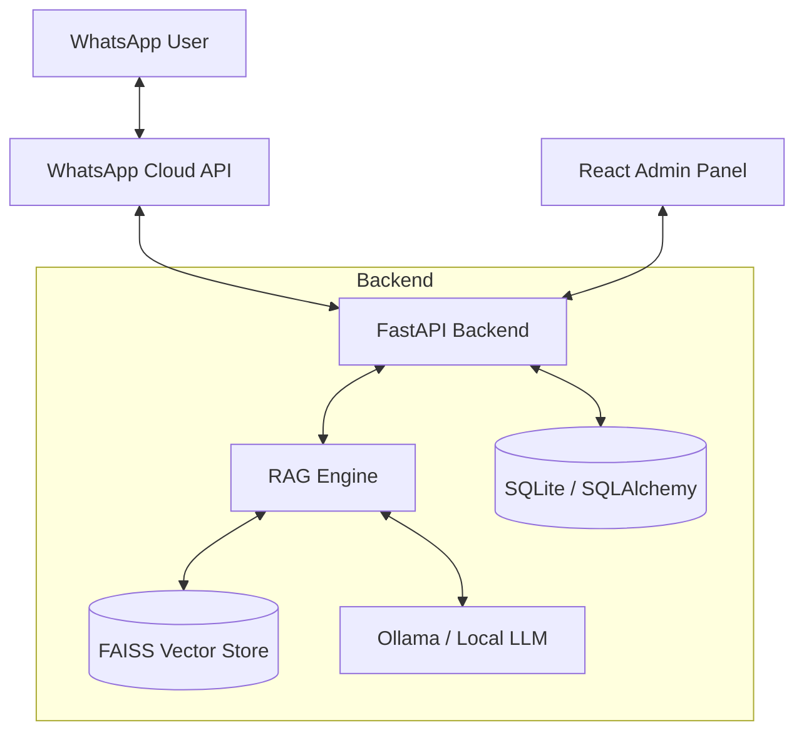

# 🤖 WhatsApp RAG Bot Platform

A multi-tenant, AI-powered WhatsApp chatbot platform designed for businesses to provide instant, context-aware customer support and automation using Retrieval-Augmented Generation (RAG).

Built with **FastAPI**, **React 19**, and **Ollama**, this platform allows businesses to upload their knowledge base and deploy a WhatsApp bot that understands their specific business data.

---

## ✨ Key Features

*   **💬 WhatsApp Cloud API Integration**: Native integration for seamless customer communication.
*   **🧠 Advanced RAG Pipeline**: Uses Semantic or Recursive chunking to retrieve relevant business context.
*   **🏢 Multi-Tenant Architecture**: Support for multiple businesses with isolated data, documents, and analytics.
*   **🛠️ Business Tools**: Built-in support for Order tracking and Booking management.
*   **📊 Analytics Dashboard**: Real-time insights into message volume, tool usage, and bot performance.
*   **📄 Document Support**: Upload PDFs and TXT files to train your AI assistant instantly.
*   **🔒 Privacy-Focused**: Runs local LLMs via Ollama (e.g., Llama 3) for data security.
*   **⚡ Modern Frontend**: Sleek, responsive admin panel built with React 19 and custom CSS.

---

## 🏗️ Architecture



---

## 🛠️ Tech Stack

### Backend
*   **Framework**: FastAPI
*   **Database**: SQLite (via SQLAlchemy ORM)
*   **RAG Engine**: LangChain
*   **Embeddings**: `sentence-transformers` (all-MiniLM-L6-v2)
*   **Vector Store**: FAISS
*   **LLM**: Ollama (Llama 3)

### Frontend
*   **Framework**: React 19 (Vite)
*   **Icons**: Lucide React
*   **Routing**: React Router 7
*   **Styling**: Custom CSS (WhatsApp Design System)

---

## 📁 Project Structure

```
whatsappChatbot/
├── backend/                # FastAPI Application
│   ├── app/
│   │   ├── api/            # API Endpoints (WhatsApp, Analytics, etc.)
│   │   ├── core/           # Configuration and Business Logic
│   │   ├── db/             # Database Models and Session
│   │   ├── rag/            # RAG Pipeline (Processor, Vector Store)
│   │   └── schemas/        # Pydantic Models
│   └── tests/              # Backend Test Suite
├── frontend/               # React Application
│   ├── src/
│   │   ├── components/     # UI Components
│   │   ├── context/        # Business Context Providers
│   │   ├── pages/          # Admin Dashboard Pages
│   │   └── assets/         # Images and SVGs
├── storage/                # Persistent Storage
│   ├── uploads/            # Uploaded Business Documents
│   └── vectors/            # FAISS Vector Indices
└── _bmad/                  # Business Model Agentic Design Specs
```

---

## 🚀 Getting Started

### Prerequisites
*   Python 3.10+
*   Node.js 18+
*   [Ollama](https://ollama.com/) (installed and running)

### 1. Setup Backend
1.  Navigate to the backend directory:
    ```bash
    cd backend
    ```
2.  Create a virtual environment and install dependencies:
    ```bash
    python -m venv venv
    source venv/bin/activate  # On Windows: venv\Scripts\activate
    pip install -r requirements.txt
    ```
3.  Create a `.env` file (see `app/core/config.py` for variables):
    ```env
    DATABASE_URL=sqlite:///./sql_app.db
    WHATSAPP_TOKEN=your_token
    WHATSAPP_PHONE_ID=your_id
    LLM_MODEL=llama3
    ```
4.  Run the server:
    ```bash
    uvicorn app.main:app --reload
    ```

### 2. Setup Frontend
1.  Navigate to the frontend directory:
    ```bash
    cd frontend
    ```
2.  Install dependencies:
    ```bash
    npm install
    ```
3.  Start the development server:
    ```bash
    npm run dev
    ```

### 3. Setup Ollama
Ensure Ollama is running and you have the model pulled:
```bash
ollama pull llama3
```

---

## 📈 RAG Workflow
1.  **Ingestion**: Business uploads PDF/TXT via Admin Panel.
2.  **Processing**: `DocumentProcessor` splits text using **Semantic Chunking**.
3.  **Embedding**: Chunks are converted to vectors using `all-MiniLM-L6-v2`.
4.  **Indexing**: Vectors are stored in a business-specific **FAISS** index.
5.  **Retrieval**: When a WhatsApp message arrives, the system searches the FAISS index for relevant context.
6.  **Generation**: Context + Query are sent to **Ollama** to generate a precise response.

---

## 🤝 Contributing
Contributions are welcome! Please feel free to submit a Pull Request.

## 📜 License
This project is licensed under the MIT License.
